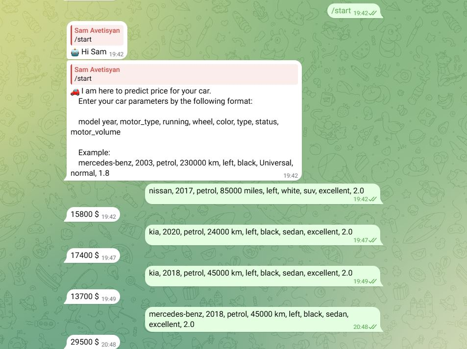
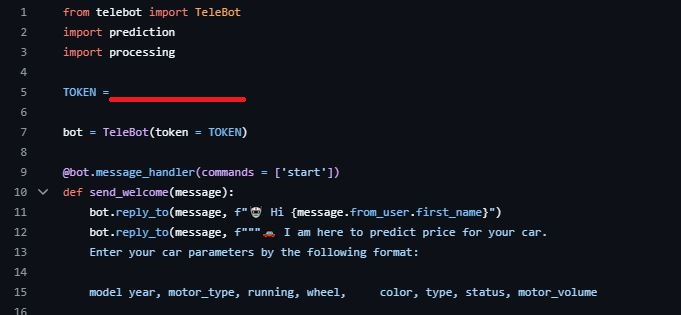

# 🚗 Car Price Prediction Telegram Bot

This project is a Telegram bot that predicts car prices based on a trained machine learning model. Users provide car specifications through a chat interface, and the bot returns an estimated price.

---

## 🤖 Features

- Predicts car prices using a trained neural network
- Accepts natural text input with car details
- Handles preprocessing (label encoding, scaling) dynamically

---

🧠 ML Model Logic

The car price prediction model is trained on real-world car listing data. It uses the following features:

model, year, motor_type, running, color, type, status, motor_volume

Workflow:
1. Preprocessing:

- Categorical features are encoded using LabelEncoder
- The encoders for each feature are saved as .pkl files (e.g., label_model.pkl, label_color.pkl) in the model_files/ directory
- Mileage values like "km" or "miles" are converted to a numeric format (with miles converted to kilometers using a coefficient)
- Features are scaled using StandardScaler, which is also saved as scaler.pkl

2. Model Architecture:

- A deep neural network built with Keras
- The output layer uses a linear activation function to perform regression

3. Deployment:

- The trained model is stored as model2.pkl using pickle
- Encoders and scaler are loaded at runtime to ensure input data matches the training format
- The Telegram bot feeds user input through the same preprocessing pipeline before making a prediction

---

## 🧾 Example Input Format

After starting the bot with `/start`, send a message like this:
mercedes-benz, 2018, petrol, 45000 km, left, black, sedan, excellent, 2.0



## 🛠️ Setup Guide

## 1. Clone the repository
Open your environment and clone the repository
```bash
git clone https://github.com/SammSM/Car_Price_Prediction.git
```
## 2. Change to Car_Price_Prediction directory
```bash
cd Car_Price_Prediction
```
## 3. Add webdriver in folder with files

## 4. Create a virtual environment and activate it

- ### Create a virtual environment
On Windows:
```bash
python -m venv venv
```
On macOS / Linux:
```bash
python3 -m venv venv
```
- ### Activate the virtual environment
On Windows:
```bash
venv\Scripts\activate
```
On macOS / Linux:
```bash
source venv/bin/activate
```

## 5. Install PIP package manager for Python
```bash
py -m pip install --upgrade pip
```
### Or
```bash
python -m pip install --upgrade pip
```

## 6. Install requirements
```bash
pip install -r requirements.txt
```

## 7. Get token from BotFather in Telegram.
- Enter /start in BotFather and follow the instruction

- Paste the generated token in bot.py
  


## 8. Run auto_bot.py
```bash
py bot.py
```
Open the bot and enter /start
